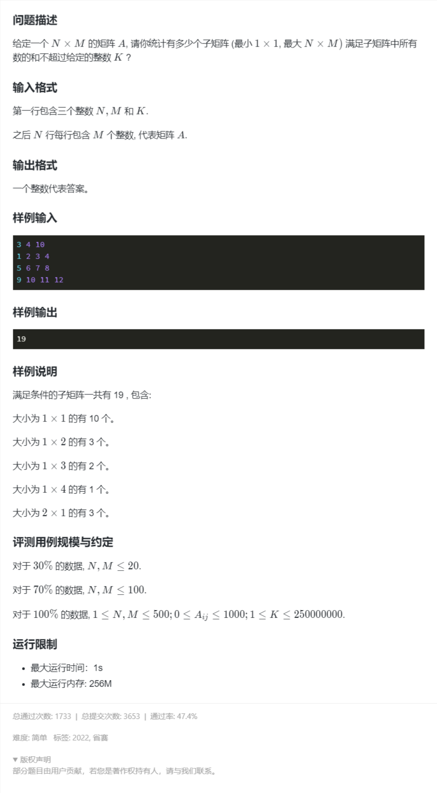

# 统计子矩阵
## 标签
- 滑动窗口
- 前缀和
## 问题描述
[题目链接](https://www.lanqiao.cn/problems/?first_category_id=1&sort=students_count&problem_id=2109)

## 代码
``` java
import java.util.Scanner;

public class CalcSubMatrix {
	public static void main(String[] args) {
		Scanner scan = new Scanner(System.in);
		int N = scan.nextInt();
		int M = scan.nextInt();
		int K = scan.nextInt();
		int[][] matrix = new int[N + 1][M + 1];
		for (int i = 1; i < N + 1; ++i) {
			for (int j = 1; j < M + 1; ++j) {
				matrix[i][j] = scan.nextInt();
			}
		}
		int[][] dp = new int[N + 1][M + 1];
		for (int i = 1; i < N + 1; ++i) {
			for (int j = 1; j < M + 1; ++j) {
				dp[i][j] = dp[i - 1][j] + dp[i][j - 1] - dp[i - 1][j - 1] 
						   + matrix[i][j];
			}
		}
		int count = 0, sum = 0;
		for (int i0 = 1; i0 < N + 1; ++i0) {
			for (int i = i0; i < N + 1; ++i) {
				int j = 1;
				int j0 = 1;
				while(j >= j0 && j < M + 1) {
					sum = dp[i][j] - dp[i][j0 - 1] - dp[i0 - 1][j] + dp[i0 - 1][j0 - 1];
					if (sum <= K) {
						++j;
						if (j >= M + 1) {
							int temp = j - j0;
							count += (temp + 1)* temp  / 2;
						}
					} else if (sum > K) {
						count += j - j0;
						++j0;
						if (j0 > j) {
							++j;
						}
					}
				}
			}
		}
		System.out.println(count);
		scan.close();
	}
}
```